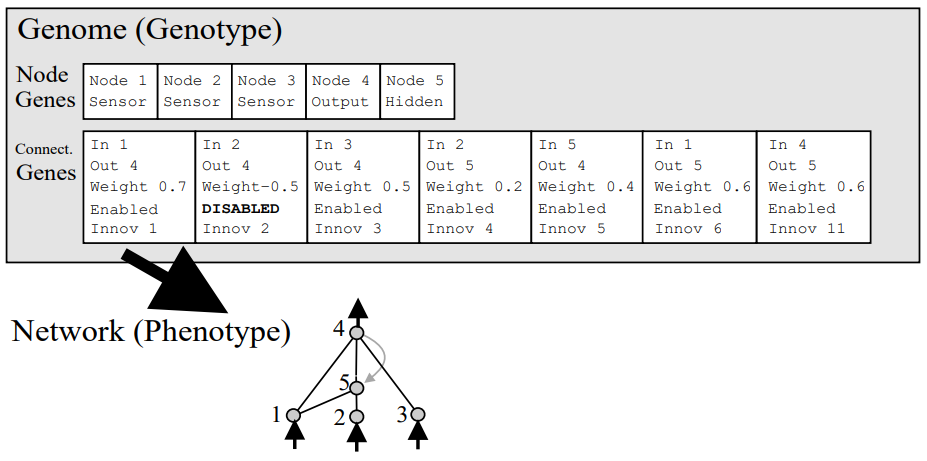
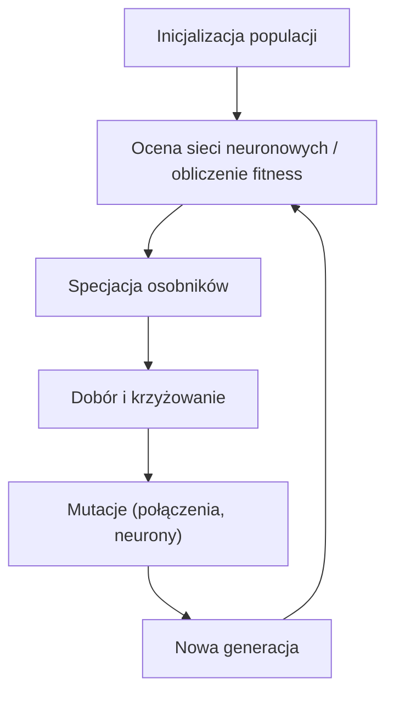
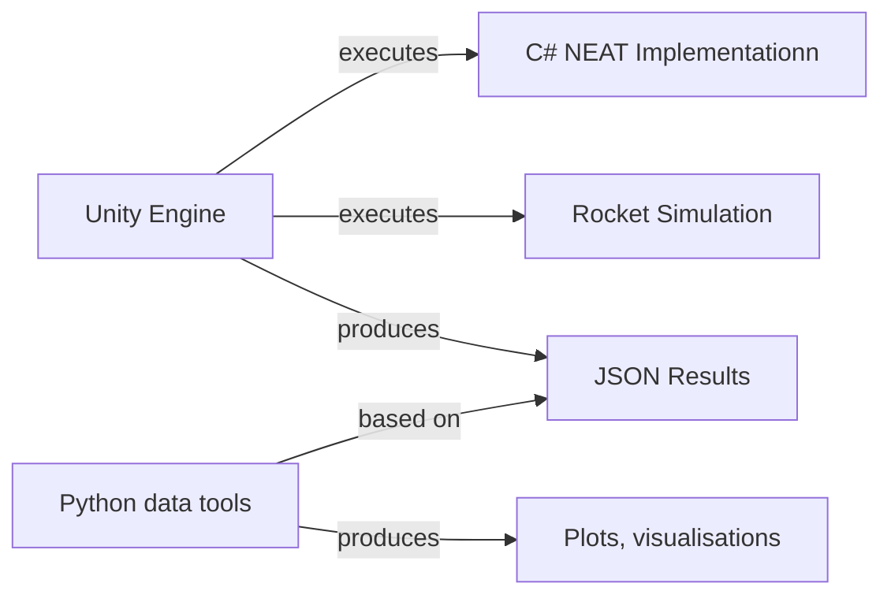

# Implementacja algorytmu NEAT (NeuroEvolution of Augmenting Topologies), przykłady zastosowań

## Autorzy: Jakub Stępień, Dawid Jasiorowski

### luty 2025 - maj 2025

# Opis projektu

NEAT to genetyczny algorytm służący do generacji i trenowania modeli sieci neuronowych. Dobiera on zarówno wagi jak i topologię sieci w celu optymalizacji jej do osiągnięcia danego celu, opisanego przez tak zwaną **fitness function**.

Algorytm został zaimplementowany na podstawie artykułu samych autorów algorytmu:

[STANLEY, Kenneth O.; MIIKKULAINEN, Risto. Evolving neural networks through augmenting topologies. Evolutionary computation, 2002, 10.2: 99-127.](https://nn.cs.utexas.edu/downloads/papers/stanley.ec02.pdf)

### Kluczowe pojęcia

- **fitness function** - funkcja opisująca “performance” danej sieci neuronowej, to ją model będzie maksymalizował
- **gen** - struktura danych przechowująca informację o danym neuronie lub połączeniu. (Id, typ neuronu, wagę itd)
- **genom** - struktura danych przechowująca pełen zestaw genów danej sieci neuronowej, na jego podstawie możemy potem zbudować sieć neuronową
- **populacja / pokolenie / generacja -** zbiór aktualnie rozpatrywanych genomów
- **specjacja** - podział populacji na podgatunki
- **krzyżowanie / crossover** - tworzenie nowych genomów na podstawie innych genomów
- **mutacja** - modyfikacja genomu, zmiana wagi, dodanie neuronu itd.



Źródło: [STANLEY, Kenneth O.; MIIKKULAINEN, Risto. Evolving neural networks through augmenting topologies. Evolutionary computation, 2002, 10.2: 99-127.](https://nn.cs.utexas.edu/downloads/papers/stanley.ec02.pdf)

### Ogólny schemat działania



- **Inicjalizacja populacji** - Tworzymy z góry określoną liczbę genomów z losowymi genami
- **Ocena sieci neuronowych** - Obliczamy fitness, może to być prosta funkcja, albo skomplikowna symulacja
- **Specjacja osobników** - Mniej złożone topologie otrzymują przewagę na starcie gdyż potrzebują mniej czasu aby znaleźć optymalne wagi, stąd sieci “rywalizują” w ramach swojego podgatunku, w ten sposób unikamy zbyt szybkiego odrzucenia nieco bardziej wyszukanej topologii
- **Dobór i krzyżowanie** - dobieramy genomy z najwyższym wynikiem fitness i na ich podstawie tworzymy nowe genomy potomne
- **Mutacja** - Losowe genomy otrzymują losowe mutację w ten sposób wprowadzając nowe wagi i topologie do populacji
- **Nowa generacja** - W ten sposób otrzymujemy nową generacje, wracamy do kroku 2

### Przykłady zastosowania

Działanie algorytmu pokazujemy na kilku przykładowych przypadkach użycia:

- aproksymacja funkcji kwadratowej
- aproksymacja funkcji XOR
- optymalizacja lądowania rakiety

Symulacja lądowania rakiety została zaimplementowana w silniku do tworzenia gier Unity. Dodatkowo, stworzyliśmy skrypty do wizualizacji postaci oraz wyników sieci w języku Python.

# Analiza systemowa

## Przypadki użycia

### UC1. Trening i ewaluacja modelu do aproksymacji funkcji.

**Opis**: Jako badacz chcę móc wykorzystać model NEAT do aproksymacji danej funkcji.
**Stan początkowy**: Badacz posiada próbkę danych z wybranego rozkładu funkcji, którą chce aproksymować.
**Stan końcowy**: Badacz posiada model sieci neuronowej, która przewiduje wartość funkcji dla zadanej wartości x .
**Podstawowy przebieg użycia**:

1. Badacz włącza środowisko Unity.
2. Badacz dobiera hiperparametry modelu.
3. Badacz uruchamia proces treningu używając Test Inspectora Unity
4. Badacz posiada model, który przewiduje wartości funkcji dla danego wejścia.

### UC2. Trenowanie modelu do zadania lądowania rakiety.

**Opis**: Jako badacz chcę móc wytrenować model sieci neuronowej, który optymalnie wyląduje rakietą.
**Stan początkowy**: Badacz chce optymalnie rozwiązać problem lądowania rakiety
**Stan końcowy**: Badacz posiada model sieci neuronowej, która optymalnie rozwiązuje problem lądowania.
**Podstawowy przebieg użycia**:

1. Badacz włącza środowisko Unity.
2. Badacz dobiera hiperparametry modelu.
3. Badacz klika przycisk `Play` w środowisku Unity.
4. Badacz czeka kilka godzin na wytrenowanie modelu.
5. Badacz otrzymuje modele sieci neuronowej w formacie JSON w raz z informacją, które sieci najlepiej poradziły sobie z problemem lądowania.

### UC3. Podgląd pojedyńczego wytrenowanego agenta.

**Opis**: Jako badacz chcę móc zobaczyć działanie wybranego przeze mnie wytrenowanego modelu sieci.
**Stan początkowy**: Badacz chce widzieć jak wytrenowany model rozwiązuje zadanie optymalnego lądowania.
**Stan końcowy**: Badacz widzi jak ląduje wybrany przez niego model.
**Podstawowy przebieg użycia**:

1. Badacz włącza środowisko Unity.
2. Badacz dodaje do środowiska reprezentację wytrenowanego modelu w postaci pliku JSON.
3. Badacz klika przycisk `Play` w środowisku.
4. Badacz widzi jak wybrany model radzi sobie z problemem lądowania.

## Podział prac w projekcie

- **Jakub Stępień**: implementacja algorytmu NEAT, środowiska treningowego oraz skryptów do wizualizacji
- **Dawid Jasiorowski**: implementacja skryptów metryk, sieci neuronowej, dokumentacja

## Etapy wykonania projektu

| Etap | Data rozpoczęcia | Data zakończenia |
| --- | --- | --- |
| Przygotowanie modelu rakiety oraz skryptów pomiarów | luty 2025 | marzec 2025 |
| Implementacja algorytmu NEAT | marzec 2025 | kwiecień 2025 |
| Implementacja środowiska treningowego dla rakiet | kwiecień 2025 | maj 2025 |
| Trenowanie modelu | maj 2025 | maj 2025 |
| Ewaluacja rezultatów | maj 2025 | maj 2025 |

# Architektura aplikacji

### Schemat ogólny




Jako fundament naszej symulacji zdecydowaliśmy się na silnik Unity, z racji na jego popularność, stabilność i możliwość programowania w języku C#, który obaj znamy. Wyniki działania algorytmu NEAT zapisujemy w formacie JSON, gdyż jest to format, który jest łatwy w odczycie i przesyle. Pozwala on 2 różnym badaczom na dzielenie się ze sobą wynikami swoich symulacji. Rezultaty algorytmu przedstawiamy za pomocą skryptów w Pythonie i Jupyter notebooków, które są powszechnie stosowane w branży do analizy danych. Wyborem naszym pokierowała także poprzednia znajomość tych narzędzi, i ich łatwość użycia do naszego zastosowania.

## Diagram klas

```mermaid

```

# Ewaluacja wyników

## Aproksymacja XOR

Funkcja XOR to operator logiczny który przyjmuje 2 wejścia. Poniższa tabela opisuje wartości funkcji XOR dla poszczególnych wejść.

|  | 0 | 1 |
| --- | --- | --- |
| **0** | 0 | 1 |
| **1** | 1 | 0 |

Funkcja XOR nie jest liniowo separowalna, co sprawia że najprostsze modele typu Perceptron nie rozwiążą poprawnie tego problemu.

Najprostszy topologia sieci neuronowej produkowany przez algorytm NEAT, która pozwala na rozwiązanie problemu XOR poprawnie wygląda mniej więcej tak:


Źródło: [STANLEY, Kenneth O.; MIIKKULAINEN, Risto. Evolving neural networks through augmenting topologies. Evolutionary computation, 2002, 10.2: 99-127.](https://nn.cs.utexas.edu/downloads/papers/stanley.ec02.pdf)

Jak widać wymaga ona co neuronu ukrytego, a więc algorytm będzie musiał skutecznie zmodyfikować topologię, aby znaleźć to rozwiązanie

### Fitness function

$$
fitness = 16 - \sum_{i=1}^4{ (y_i-network\_output(1, x_1, x_2))^2}
$$

Wizualizacje treningu:


Po treningu nasz model zwraca takie wyniki:

| x1 | x2 | model output |
| --- | --- | --- |
| 0 | 0 | 1.05921E-5 |
| 0 | 1 | 0.9860913 |
| 1 | 0 | 0.996724 |
| 1 | 1 | 0.04070053 |

Wyniki bardzo zbliżone do prawidłowych, co więcej jeżeli spojrzymy na topologię


To okazuje się, że znaleźliśmy dokładnie optymalną topologię

## Aproksymacja funkcji kwadratowej

Kolejnym problemem, który zadaliśmy naszemu algorytmowi jest przewidywanie wartości funkcji kwadratowej na podstawie próbki danych. W tym przypadku fitness określamy przez po prostu liczbę przeciwną to **MSE** (mean squared error)

### Trening


Finalne dopsaowanie wygląda tak:


## Optymalne lądowanie rakietą

Stworzyliśmy prosty 3-wymiarowy model rakiety i zadaliśmy algorytmowi zadanie optymalizacji lądowania pionowego w taki sposób, aby możliwie łagodnie uderzyła o ziemię.


### Fitness function

Fitness obliczany jest w następujący sposób

- Sieć otrzymuję na początku określoną wartośc fitness
- Przy uderzeniu w ziemię, otrzymuje karę proporcjonalną do kwadratu prędkości w chwili uderzenia
- Za to za każdą sekundę kontaktu z podłożem otrzymuje określoną wartość nagrody

### Trening

[Wideo z treningu](./assets/training.mp4)


### Lądowanie w wykonaniu najlepszej sieci

[Wideo z lądowania](./assets//landing.mp4)